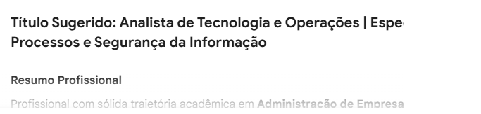
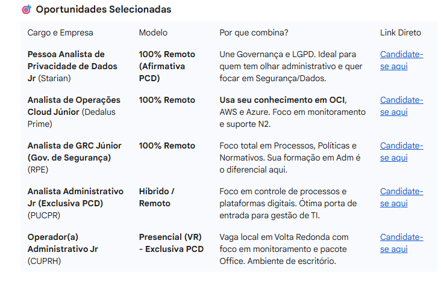

# 🚀 Suite de Assistentes Inteligentes para Candidatura a Vagas

Este projeto consiste em uma suíte de Gems (GPs customizados) desenvolvidos para otimizar o ciclo de busca e candidatura a vagas de emprego.

Utilizando inteligência artificial generativa, os assistentes atuam desde a curadoria de oportunidades até a personalização técnica de documentos, aumentando a eficiência e assertividade do candidato.

---

## 🎯 Objetivo

Automatizar e potencializar o processo de candidatura, oferecendo suporte estratégico e técnico em cada etapa, desde a identificação da vaga até a entrega de um currículo altamente aderente.

---

## 🧩 Estrutura do Ecossistema

O ecossistema é dividido em três pilares fundamentais:

- **Adaptador de Currículo**
- **Destaque de Pontos Positivos**
- **Consultor de Vagas**

Cada assistente atua de forma complementar, criando um fluxo inteligente e integrado.

---

## 🤖 Assistentes

| Assistente                     | Função Principal                                                                 |
|------------------------------|----------------------------------------------------------------------------------|
| Adaptador de Currículo        | Ajusta o currículo conforme a vaga, otimizando palavras-chave e aderência       |
| Destaque de Pontos Positivos  | Evidencia competências e experiências mais relevantes                           |
| Consultor de Vagas            | Analisa vagas e orienta estratégias de candidatura                              |

---

## 🖼️ Exemplos Visuais dos Assistentes

### 🔧 Assistente - Adaptador de Currículo

---

### 🧠 Assistente - Consultor de Vagas

---

### 📊 Resultado Gerado

---

## ⚙️ Como Utilizar

1. Escolha uma vaga de interesse
2. Utilize o **Consultor de Vagas** para análise estratégica
3. Aplique o **Adaptador de Currículo** para personalização
4. Utilize o **Destaque de Pontos Positivos** para refinar o conteúdo
5. Gere um currículo otimizado e pronto para envio

---

## 💡 Diferenciais

- Uso de IA generativa para personalização avançada
- Foco em aderência real às vagas
- Processo estruturado e replicável
- Redução de tempo na candidatura
- Aumento da competitividade do candidato

---

## 👩‍💻 Autoria

Projeto acadêmico desenvolvido para otimizar processos de candidatura com apoio de Inteligência Artificial .

---

## 📌 Deploy

https://job-gem.vercel.app/

